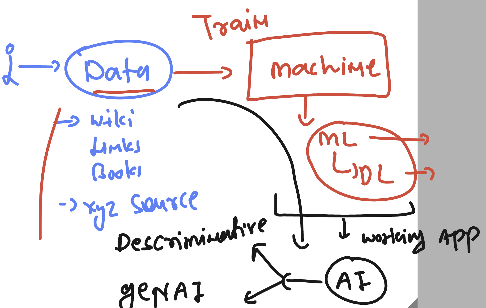
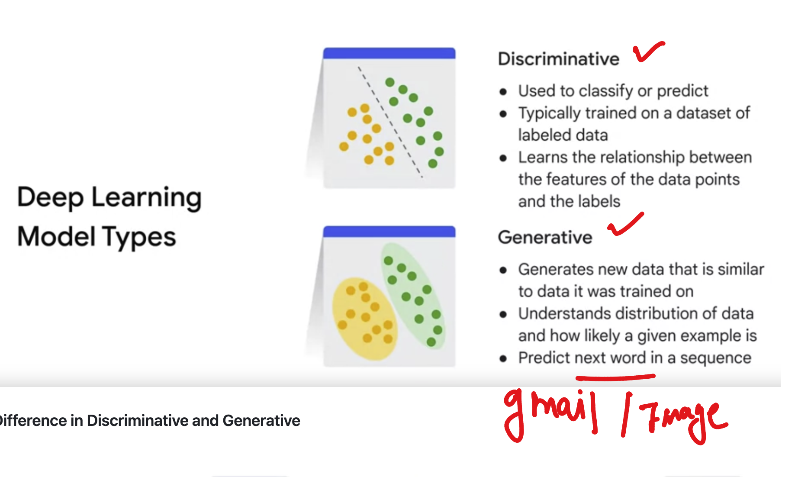
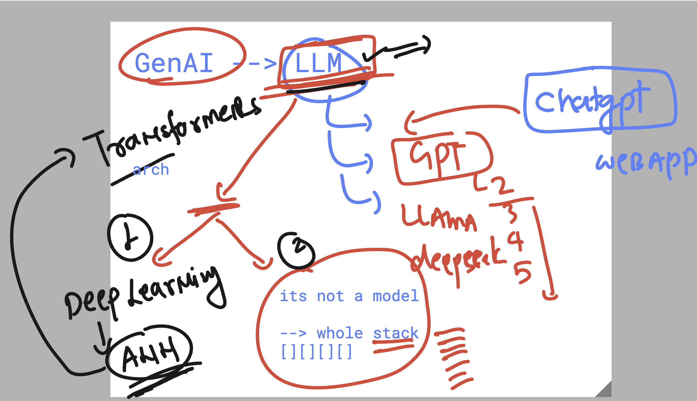

# walmart_LLM_RAG_11thaug2025CST

### ML to GENAI -- flow 

### GenAI 

## LLM info 

### More FM info 

### LLM as stack understanding 

## at basic level LLM with respect to a user of LLM 

### tokenization in LLM 

### overall any LLM is following given stack to generate response of given INput/prompt by user

