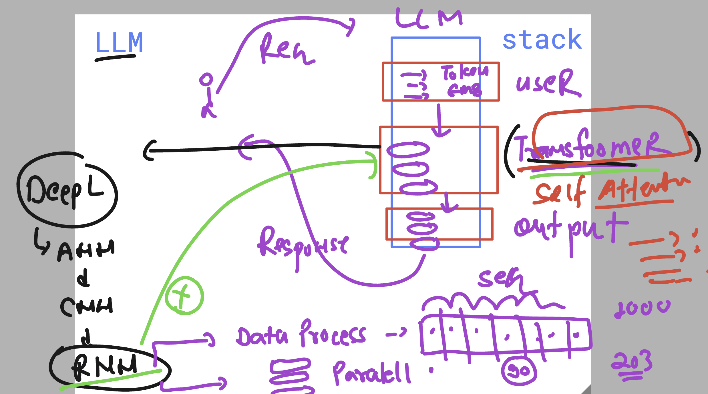
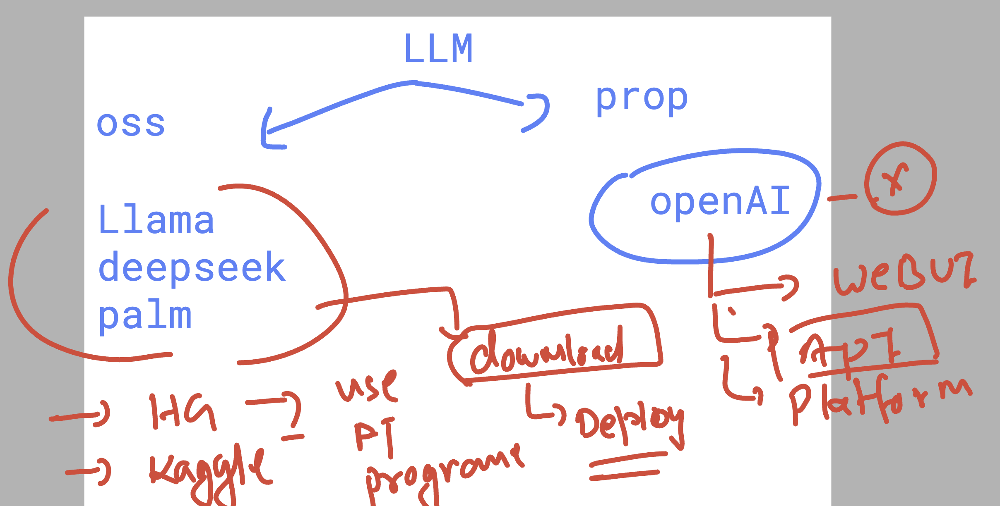
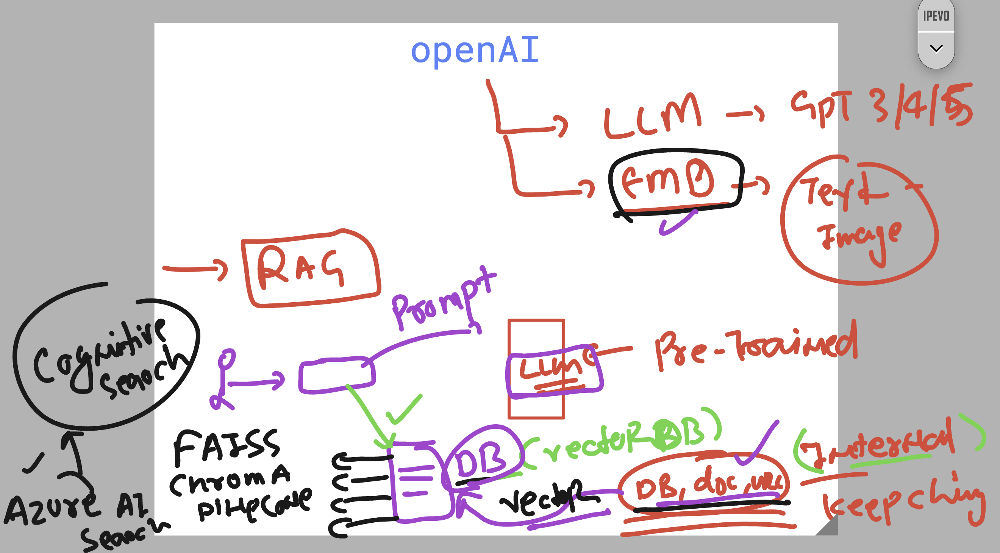
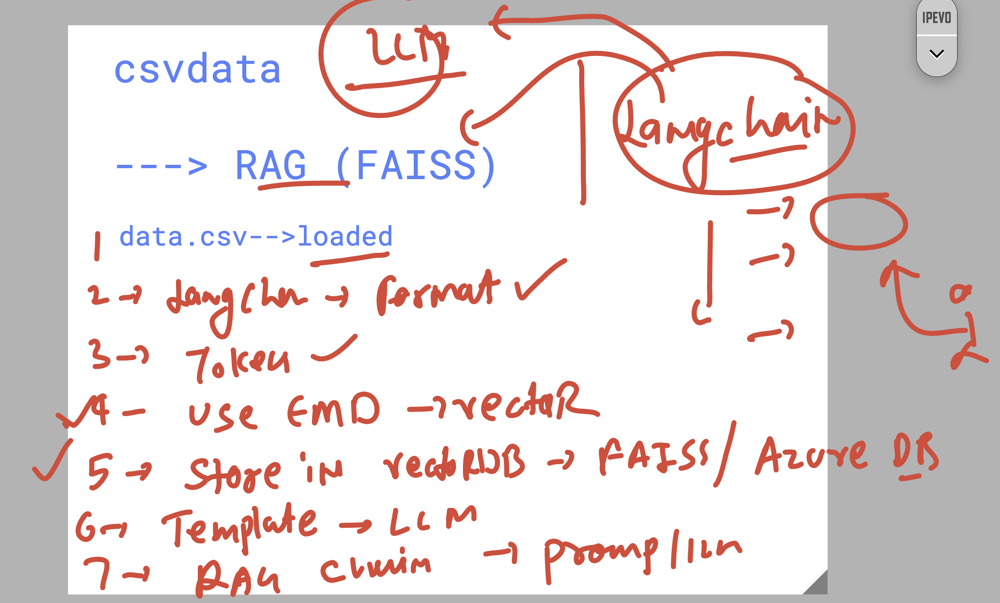
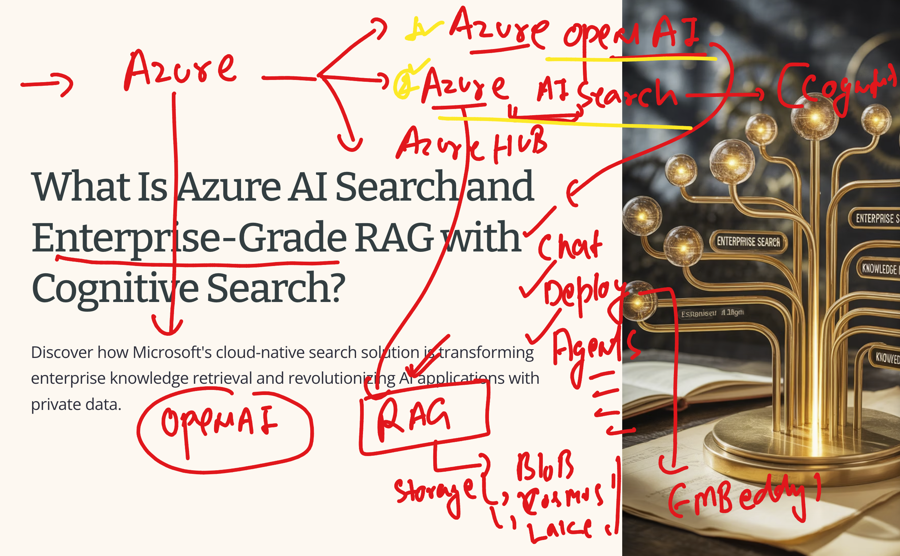

# walmart_LLM_RAG_11thaug2025CST

### More details about LLM stack --> transfomers 



### OSS vs Props LLM 



### more info about RAG 



## Understanding RAG with FAISS vector Db 



## Introduction to azure openai & azure AI search (cognitive search)



### RAG with azure openAI 


### running streamlit app 

```
streamlit run  streamapp.py 
```